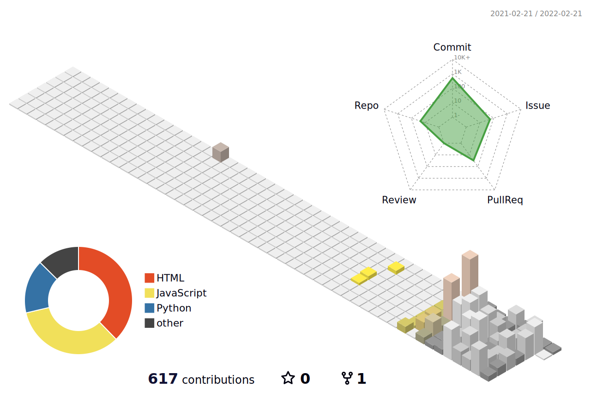

 

  안녕하세요. 파이썬과 자바스크립트를 잘 사용하는 풀스택 웹 개발자를 지향합니다. 
  Hello. I aim to become a fullstack web developer who uses Python and JavaScript well.

      
  
  ___

  
   
     
     
   
   
  
   
     
    
  
   

  
  

  ___
  
  

  
  
  

